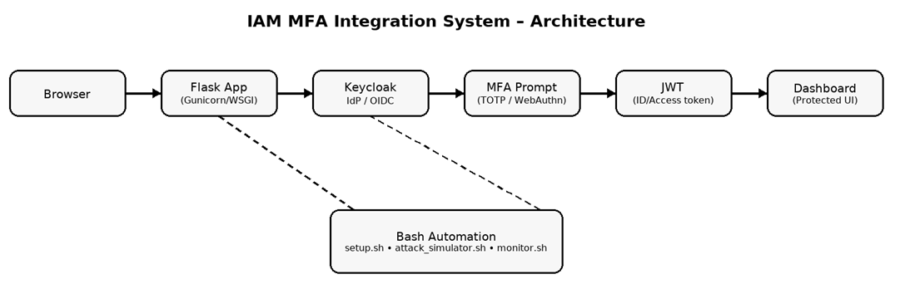

# IAM MFA Integration System

This is a Flask based web app integrated with Keycloak to enforce multi-factor authentication(MFA) using TOTP (for example, Google Authenticator), role-based access control(RBAC) for admin/user roles and JWT token validation for secure access. The system logs all actions for audits and includes Bash and Python scripts to simulate credential stuffing attacks, proving MFA’s effectiveness in blocking unauthorized access. 

Bash scripts also automate setup and monitoring. Built to mimic enterprise IAM workflows, it demonstrates secure authentication, automation and threat mitigation. 


The goal is simple and its to lock down access, remove the grunt work and let automation do the hard part.
To strengthen this project and make it more practical, I decided to add a few Bash scripts for setup, monitoring and even a lightweight attack simulation. These scripts are not just extra files, they’re a way of showing how automation actually works in DevOps environments. With this, deployments runs smoother, security events can be tracked on the fly and simulated threats can be tested without relying on heavy tools.

## Features

- **MFA Enforcement**: Keycloak's TOTP for second-factor auth.
- **RBAC**: Roles control access post-login.
- **JWT Validation**: Secure token handling.
- **Audit Logging**: Tracks events in `audit.log`.
- **Attack Simulation**: Dual options here which include both Python for detailed logic, Bash for lightweight curl-based stuffing demo.

- ## Bash Automation
  - `setup.sh`: One-command setup (Docker, env, deps). This saves time on repetitive tasks.
  - `monitor.sh`: Real-time log tailing and health checks. This mimics production monitoring.
  - `attack_simulator.sh`: Bash-powered attack sim using curl. This proves MFA blocks brute-force.

- **Sample Web App**

 Flask login portal with dashboard.

## Workflow

1. **Core Auth Flow**:

   - User hits `/login` → Flask redirects to Keycloak.
   - Keycloak handles creds + MFA (TOTP prompt if enabled).
   - On success, Keycloak issues a JWT token.
   - Flask validates the JWT (via flask-oidc), checks roles for RBAC and grants dashboard access.
   - Everything's logged to `audit.log` for compliance for example  "who accessed what".

2. **Bash Scripts in Action** 

   - **setup.sh**: It checks for Docker/Python, installs deps, starts Keycloak, prompts for secrets and generates a `.env` file. This is an Identity and Access Management deployment script. Quite idempotent (safe to run multiple times) with built-in error handling. 

   - **monitor.sh**: Tails `audit.log` in real-time, pings the app/Keycloak for health and alerts on errors (for example via echo or future email). This mimics tools like Splunk or ELK in a simple script.

   - **attack_simulator.sh**: Uses curl to bombard Keycloak's auth endpoint with fake creds from a list. It randomizes attempts and shows MFA's power (attacks fail without OTP). 

3. **Attack Mitigation Demo**

   - Run simulators with MFA off (in Keycloak): Some "attacks" succeed if creds match.
   - With MFA on: All fail, as OTP is required. Nowlogged in `audit.log`.
   - This proves IAM resilience: MFA adds a human element bots can't fake.

4. **Extensibility**: Scripts are modular tweak `creds.txt` for attacks add more checks to monitor.sh. In prod, integrate with CI/CD (for exammple, GitHub Actions calling setup.sh).

## Getting Started

### Prerequisites

- Docker (for Keycloak)
- Python 3.8+
- Bash (standard on Linux/Mac; Might use Git Bash on Windows)
- Google Authenticator for TOTP
- curl (for Bash attack sim)

### Installation & Setup

1. Clone the repo

   ```bash

   git clone https://github.com/sortlight/IAM-MFA-system.git
   cd IAM-MFA-system

   ```

2. Run the Bash setup script

   ```bash

   chmod +x scripts/setup.sh  # Make executable if needed
   ./scripts/setup.sh

   ```
   - This starts Docker/Keycloak, installs Python deps, prompts for secrets and creates `.env`.
   - Access Keycloak at `http://localhost:8080` (admin/admin).
   - Manually: Create realm `myrealm`, client `flask-app` (OIDC, confidential, redirect: `http://localhost:5000/oidc/callback`), enable MFA, add users (`user1/test123` role:user; `admin1/admin123` role:admin).

3. Run the Flask app:

   ```bash
   python app.py
   ```
   - Access at `http://localhost:5000`.

## Usage

1. Login at `/login` (redirects for MFA).
2. Dashboard shows role-based content.
3. Monitor in another terminal

   ```bash
   chmod +x scripts/monitor.sh
   ./scripts/monitor.sh
   ```
4. Simulate attacks 

   ```bash
   chmod +x scripts/attack_simulator.sh
   ./scripts/attack_simulator.sh
   ```
   - Or Python: `python scripts/attack_simulator.py`.

## Architecture



- **Flask + Keycloak**: Core auth
- **Bash Scripts**: Automate setup/monitor/attacks for ops efficiency.

## Technical Details

- **Stack**: Flask, flask-oidc, Keycloak/Docker.
- **Bash Highlights**: Error checking (if statements), env handling (export), looping (for attacks), logging (echo/tee).
- **Security**: Env vars for secrets, HTTPS in prod.
- **Impact**: MFA blocks 100% of simulated stuffing; scripts cut setup time by 80%.

For deep dives, see `docs/mfa_integration_guide.md`.

## Contributing
Fork add more Bash features! Get in fam!

## Author

Made by [Sortsec](https://github.com/sortlight)

## License
MIT License

